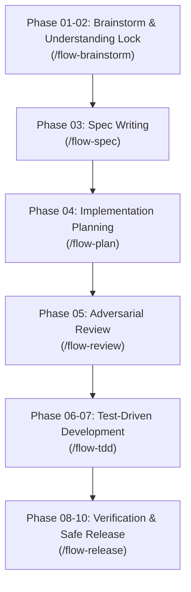

# 📖 The Complete Guide to Using Antigravity Flow (`agy-flow`)

> A practical, step-by-step user guide to building software with **Google Antigravity CLI (`agy`)** using the `agy-flow` engineering framework.

---

## 🌟 1. What is `agy-flow` and What Problems Does It Solve?

When using AI coding assistants without a framework, four major problems usually occur:
1. **Premature Coding & Guesswork**: The AI starts writing code immediately based on assumptions, producing code that doesn't fit your architecture.
2. **Session Amnesia & Token Waste**: In every new turn or session, the AI re-scans the whole directory tree (`find`, `grep`, reading 20 files), burning 20%–30% of your context window just to understand what exists.
3. **Weak or Missing Tests**: The AI writes code first and adds weak tests later (or forgets tests entirely).
4. **Documentation Drift**: The codebase changes, but documentation is never updated, leaving future agents with stale lies.

### How `agy-flow` Fixes This:
`agy-flow` acts as a disciplined **Senior Lead Engineer** that guides your pair-programming sessions through clear phases, tests code before writing implementation, keeps living memory of your system in `docs/context/`, and blocks dirty commits using deterministic lifecycle hooks.

---

## 🚦 2. Task Ingestion & Socratic Routing

Whenever you give Antigravity a task, `agy-flow` prevents premature assumptions by executing disciplined context priming and Socratic dialogue:

```text
               ┌─────────────────────────────────────────────────┐
               │ You type a prompt or start a task in Antigravity│
               └────────────────────────┬────────────────────────┘
                                        │
        ┌───────────────────────────────┼───────────────────────────────┐
        ▼                               ▼                               ▼
 [Path A: SPIKE]             [STANDARD ENGINEERING]             [Path D: ONBOARDING]
 "Can we use X?"                        │                       "First time running
 "Is X possible?"                       ▼                        in this repository"
                                  Phase 01-02:
                                /flow-brainstorm
                            (1-by-1 Questions & Lock)
                                        │
                       ┌────────────────┴────────────────┐
                       ▼                                 ▼
              [Path B: BOUNDED]             [Path C: ARCHITECTURAL (DEFAULT)]
              "Trivial 1-file fix,          "Build a new feature, endpoint,
               confirmed in Lock"            major refactoring, or API change"
```

| Path | When it Triggers | What the AI Does | What You Do |
| :--- | :--- | :--- | :--- |
| **Path A: Spike** | Exploratory / discovery questions (*"Can we integrate Stripe?"*) | Runs a quick, throwaway investigation without keeping code. | Read the AI's findings and decide if you want to build it. |
| **Path B: Bounded** | Trivial 1-file typo or maintenance change (confirmed in Lock). | Proposes short in-chat design $\rightarrow$ skips formal spec with human approval. | Type `"looks good"` $\rightarrow$ AI implements directly via `/flow-tdd`. |
| **Path C: Architectural (DEFAULT)** | New features, new endpoints, contracts, refactoring. | Enforces the full **10-Phase Lifecycle** (Spec $\rightarrow$ Plan $\rightarrow$ Review $\rightarrow$ TDD $\rightarrow$ Release). | Review gates at key milestones (Spec, Plan, Release). |
| **Path D: Onboarding** | First time using `agy-flow` on an existing codebase. | Scans project structure and creates living module memory (`docs/context/`). | Approve the generated Context Routing Map in `GEMINI.md`. |

---

## 🛠️ 3. The 10-Phase Lifecycle Walkthrough (Path C)

For major features, here is the exact order of operations:



---

### Step 1: Brainstorming & The Understanding Lock (`/flow-brainstorm`)
- **What the AI does**:
  - Asks clarifying questions **strictly one at a time** using `### [Question X/Y]` progress counters and stops after each question.
  - Proposes **2–3 architecture approaches** with native Mermaid diagrams.
  - Formulates the **Understanding Lock**: a concise summary of what will be built, explicit assumptions, non-goals, and confirmed scope (Bounded vs Architectural).
- **Your Job**: Answer questions one by one. Confirm the Understanding Lock with *"Yes, that reflects my intent"*. The AI **cannot code or write specs** until you approve this gate.

---

### Step 2: Specification Writing (`/flow-spec`)
- **What the AI does**:
  - Generates an authoritative technical specification based on [`skills/flow-spec/resources/spec.md.template`](skills/flow-spec/resources/spec.md.template).
  - Uses RFC 2119 precision (`MUST`, `MUST NOT`), quantitative SLAs (e.g. `p95 < 50ms`), and runnable type schemas.
  - Saves to `docs/specs/YYYY-MM-DD-[feature]-spec.md`.
- **Your Job**: Skim the specification link. Confirm to move to planning.

---

### Step 3: Implementation Planning (`/flow-plan`)
- **What the AI does**:
  - Runs the **5 Adversarial Questions Pre-Flight Audit** (hidden assumptions, failure modes, rollback strategy, ordering, observability).
  - Breaks the feature down into **bite-sized 2–5 minute tasks** based on [`skills/flow-plan/resources/plan.md.template`](skills/flow-plan/resources/plan.md.template).
  - Defines exact `Consumes` and `Produces` interface signatures for each task.
  - Saves to `docs/plans/YYYY-MM-DD-[feature]-plan.md`.
- **Your Job**: Ensure tasks are bite-sized and no steps are hand-waved.

---

### Step 4: Adversarial Subagent Review (`/flow-review`)
- **What the AI does**:
  - Automatically dispatches an **independent AI subagent** to red-team the plan.
  - Audits for missing steps, security flaws, and **YAGNI bloat** (single-use abstractions or unrequested features).
  - Outputs an **Adversarial Review Scorecard** (`APPROVED` or `REVISION REQUIRED`).
- **Your Job**: If approved, confirm to unlock implementation.

---

### Step 5: Test-Driven Development Implementation (`/flow-tdd`)
- **What the AI does**:
  - Creates an isolated feature branch (`feature/YYYY-MM-DD-[feature]`) and initializes plan status to `In Implementation`.
  - Executes task-by-task using strict **Red-Green-Refactor cycles**:
    1. Writes the failing test (Red).
    2. Runs test command to confirm expected failure.
    3. Writes minimal implementation code (Green).
    4. Runs test command to confirm it passes.
    5. Commits atomically and marks task complete (`- [x]`) in `docs/plans/`.
  - **Plan Lifecycle Automation**: Upon 100% green verification, updates the plan status to `Implemented & Tested` and commits the plan artifact before handing off to `/flow-release`.
  - **The Golden Rule**: *If code was written before the test, the AI deletes it and starts over with the test.*

---

### Step 6: Verification, Context Sync & Release (`/flow-release`)
- **What the AI does**:
  - Runs the full test suite and static analysis linters.
  - **Diff-to-Context Sync**: Automatically updates `docs/context/[module].md` with any new interfaces or services added.
  - Prunes dead code and drafts a SemVer changelog.
- **Your Job**: Confirm merge readiness or publish a release.

---

## ⚡ 4. Specialized Commands & When to Use Them

| Slash Command | When to Use | Deliverable |
| :--- | :--- | :--- |
| **`/flow`** | Master router. Use when starting any complex task. | Classifies tier, estimates blast radius, routes to correct phase. |
| **`/flow-brainstorm`** | When exploring a new idea, feature, or onboarding a repo. | Understanding Lock summary or `docs/context/` memory. |
| **`/flow-spec`** | When authoring an RFC 2119 technical specification. | `docs/specs/YYYY-MM-DD-[feature]-spec.md` |
| **`/flow-plan`** | When authoring bite-sized, test-backed implementation tasks. | `docs/plans/YYYY-MM-DD-[feature]-plan.md` |
| **`/flow-review`** | When red-teaming specifications and plans before coding. | Adversarial Review Scorecard. |
| **`/flow-tdd`** | When implementing tasks with test-first scaffolding. | Verified code + passing test suite. |
| **`/flow-code-review`**| When performing adversarial code review before release. | Code Review Scorecard (`docs/plans/.tmp/`). |
| **`/flow-release`** | When verifying, syncing living documentation, and releasing. | Release report + synchronized `docs/context/`. |
| **`/flow-architect`** | When designing distributed systems, CQRS, Sagas, or Clean Architecture. | Component topology diagrams & DDD boundary scorecards. |
| **`/flow-adr`** | When choosing databases, auth providers, brokers, or frameworks. | `docs/adr/NNNN-[title].md` & master index `docs/adr/README.md`. |
| **`/flow-init`** | When initializing Antigravity project memory & bootstrapping a repo. | `GEMINI.md`, `AGENTS.md`, and `docs/context/` scaffolding. |
| **`/flow-skill-writer`** | When authoring or editing custom Antigravity skills. | Pressure-tested `SKILL.md` files. |
| **`/flow-version-update`**| When updating `agy-flow` to the latest GitHub version. | Automated in-chat suite update. |

---

## 🧠 5. How Living Module Memory Works (`docs/context/`)

To eliminate the 20%–30% token waste from session amnesia:

1. In your project's root `GEMINI.md`, register your core directories:
   ```markdown
   ## Context Routing Map
   - `/src/auth/`     -> docs/context/auth.md
   - `/src/api/`      -> docs/context/api.md
   - `/src/db/`       -> docs/context/database.md
   ```
2. When an agent enters your repository, it **immediately reads the mapped context file** instead of searching 50 files.
3. If an agent changes `/src/api/`, our **deterministic lifecycle hooks (`hooks.json`)** prevent the agent from ending the turn or committing until `docs/context/api.md` is updated.

---

## 🎯 6. Best Practices & Golden Rules for Users

1. **Never skip the Understanding Lock**: When the AI outputs the 5–7 bullet summary, read it carefully. Correct any wrong assumptions immediately before the AI writes specifications.
2. **Keep Tasks Bite-Sized (2–5 minutes)**: If an implementation task looks large or has multiple files, tell the AI: *"Break this task into smaller atomic steps."*
3. **Use Section Anchors for Quick Edits**: If you want to change a section of a spec or plan mid-session, tell the AI:
   > *"Update `<!-- ANCHOR: NORMATIVE_REQUIREMENTS -->` in the spec to require 2FA on login."*
4. **Update agy-flow anytime**: Simply type `/flow-version-update` in chat whenever you want the latest improvements!
