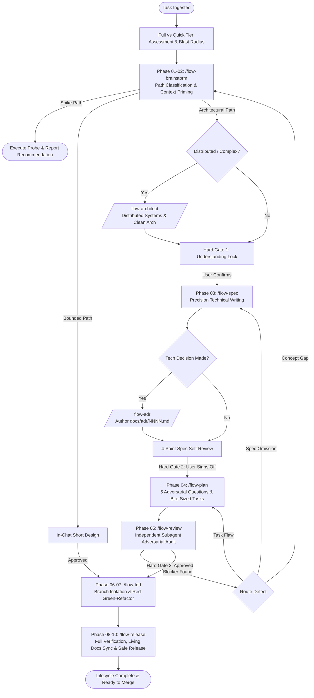

# Antigravity Flow (`agy-flow`)

> A modular **10-Phase Engineering Lifecycle**, **Distributed Systems Architecture**, and **Architecture Decision Records (ADR)** suite tailored natively for **Google Antigravity CLI (`agy`)**.

[](LICENSE)
[](https://github.com/larya-dot-eu/agy-flow)

---

## Overview

`agy-flow` transforms Google Antigravity CLI from a standard reactive assistant into a disciplined, senior pair programmer. It enforces rigorous engineering quality, eliminates premature coding and hidden assumptions, prevents model hallucinations, and guides complex initiatives through a battle-tested lifecycle.



---

## ⚡ Quick Start: 1-Command Installation

Deploy the complete suite and global prime directives to your machine in seconds:

```bash
curl -fsSL https://raw.githubusercontent.com/larya-dot-eu/agy-flow/main/install-skills.sh | bash
```

Or clone and run locally:

```bash
git clone https://github.com/larya-dot-eu/agy-flow.git
cd agy-flow
./install-skills.sh
```

---

## Global Skill Suite Reference

| Command | Phase / Role | Key Deliverable | Hard Gate / Quality Check |
| :--- | :--- | :--- | :--- |
| **`/flow`** | Master Orchestrator | Full vs Quick Tier & Blast Radius matrix | Enforces pre-flight skill invocation |
| **`/flow-brainstorm`** | Phase 01–02: Context & Ideation | In-chat design or decomposition | **Understanding Lock**: 5–7 bullet summary + assumptions |
| **`/flow-spec`** | Phase 03: Spec Writing | `docs/specs/YYYY-MM-DD-[feature]-spec.md` | **RFC 2119 Normative Language**, quantitative SLAs, runnable types |
| **`/flow-plan`** | Phase 04: Plan Writing | `docs/plans/YYYY-MM-DD-[feature]-plan.md` | **5 Adversarial Questions**, bite-sized tasks (2–5 min), zero placeholders |
| **`/flow-review`** | Phase 05: Adversarial Review | Adversarial Review Scorecard | **Independent Subagent Auditor** (`invoke_subagent: self`), 3-way loop-back |
| **`/flow-tdd`** | Phase 06–07: TDD Implementation | Verified code + passing test suite | **"Code before test = Delete & Restart"**, isolated branch |
| **`/flow-release`** | Phase 08–10: Verification & Release | Release report & PR summary | **Full suite verification**, `docs/adr/` sync, SemVer changelog |
| **`/flow-architect`** | Distributed Architecture Specialist | Architectural Scorecards & Mermaid Models | Clean/Hexagonal architecture, DDD bounded contexts, Sagas, CQRS |
| **`/flow-adr`** | Architecture Decision Records | `docs/adr/NNNN-[title].md` & `README.md` | Standard MADR, Y-Statement & RFC formats, lifecycle tracking |
| **`/flow-skill-writer`** | Meta-Skill: Skill Authoring & Testing | Tested `SKILL.md` documents | **Test-Driven Documentation (TDD)** using subagent pressure testing |

---

## Core Principles & 4-Layer Defense Engine

1. **Global Always-On Prime Directives (`GEMINI.md`)**: Automatically loaded on every turn across all directories. Mandates pre-flight skill execution and prevents agent drift.
2. **Inter-Skill Hard Hooks**: Programmatically forces `/flow-architect` when distributed systems are detected, and `/flow-adr` when permanent architecture choices are made.
3. **Physical File-Based Gates**: Progress is gated on durable filesystem artifacts (`docs/specs/`, `docs/plans/`, `docs/adr/`). Hallucinations cannot bypass file checks.
4. **Independent Subagent Audits**: Critical review phases dispatch subagents with fresh context to ruthlessly red-team plans before human sign-off.

---

## Antigravity CLI Tooling Discipline

- **Task Tracking**: Task lists (`- [ ]` / `- [x]`) are maintained in conversation and plan artifacts (`docs/plans/`). `manage_task` is reserved exclusively for background OS daemons.
- **Visual Models**: System topology, data sequences, and state transitions are rendered in native **Mermaid diagrams**.
- **Subagents**: Dispatches `invoke_subagent` (`TypeName: "self"`) for objective audits and (`TypeName: "research"`) for deep codebase surveys.

---

## License

Released under the [MIT License](LICENSE).  
Authored by [Larya](https://github.com/larya-dot-eu).
