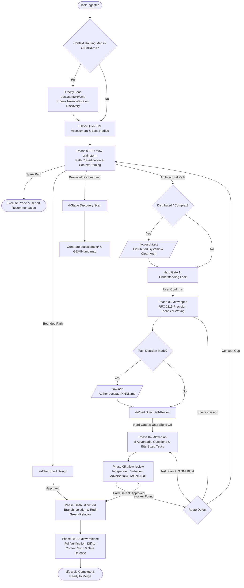

# Antigravity Flow (`agy-flow`)

> A modular **10-Phase Engineering Lifecycle**, **Zero-Discovery Context Routing**, **Deterministic Lifecycle Guards**, and **Architecture Decision Records (ADR)** suite tailored natively for **Google Antigravity CLI (`agy`)**.

[](LICENSE)
[](https://github.com/larya-dot-eu/agy-flow)
[](HOWTO.md)

---

## Overview

> 📖 **New to agy-flow?** Check out the step-by-step **[Complete User Guide (`HOWTO.md`)](HOWTO.md)** to learn how to pair-program with the 10-phase lifecycle.

`agy-flow` transforms Google Antigravity CLI from a standard reactive assistant into a disciplined, senior pair programmer. It enforces rigorous engineering quality, eliminates the 20%–30% token waste from session amnesia, prevents premature coding and hidden assumptions, blocks out-of-sync commits with deterministic lifecycle hooks, and guides complex initiatives through a battle-tested 10-phase lifecycle.



---

## ⚡ Installation & Updates

Choose the installation method that best fits your workflow:

### Option 1: 1-Command Universal Installer (Recommended)
Deploys all 11 skills, canonical templates, deterministic lifecycle hooks, and prime directives directly into `~/.gemini/config/`:

```bash
curl -fsSL https://raw.githubusercontent.com/larya-dot-eu/agy-flow/main/install-skills.sh | bash
```

Or install directly via Git (bypassing any CDN cache):
```bash
TMP_DIR=$(mktemp -d) && git clone --depth 1 https://github.com/larya-dot-eu/agy-flow.git "$TMP_DIR" && "$TMP_DIR/install-skills.sh" && rm -rf "$TMP_DIR"
```

---

### Option 2: Updating an Existing Installation (`/flow-version-update`)
To update your installed skills to the latest version at any time:

1. **In-Chat (Recommended)**: Simply ask Antigravity `/flow-version-update`.
2. **From Terminal**: Re-run the 1-command installer above.

---

### Option 3: Native Global Plugin Directory Mount
Install as an official, self-updating global Antigravity plugin:

```bash
mkdir -p ~/.gemini/config/plugins
git clone https://github.com/larya-dot-eu/agy-flow.git ~/.gemini/config/plugins/agy-flow
```

---

### Option 4: Project-Local Workspace Plugin
Mount `agy-flow` for a single repository only:

```bash
# Inside any project repository:
mkdir -p .agents/plugins
git clone https://github.com/larya-dot-eu/agy-flow.git .agents/plugins/agy-flow
```

---

## 🧩 Canonical Templates Suite (`templates/`)

`agy-flow` ships with 4 standardized, production-tested templates featuring rigid **Section Anchors** (`<!-- ANCHOR: ... -->`) for deterministic search and atomic updates:

1. **[`templates/spec.md.template`](templates/spec.md.template)**: Strict RFC 2119 Specification Template (Metadata, Abstract, Terminology, Architecture, Normative Specs, Invariants, Verification Matrix, Rollback Runbook).
2. **[`templates/plan.md.template`](templates/plan.md.template)**: Bite-Sized Implementation Plan Template (5 Adversarial Questions, File Map, Right-Sized Tasks with explicit `Consumes`/`Produces` interface signatures, TDD Steps).
3. **[`templates/context-module.md.template`](templates/context-module.md.template)**: Living Module Memory Template (Domain Purpose, Public Contracts Table, External Dependencies/MCPs, Current State Checklists).
4. **[`templates/GEMINI.md.template`](templates/GEMINI.md.template)**: Project Root Configuration Template (Stack, Context Routing Map, Frequent Commands, Agent Directives).

---

## 🛡️ Deterministic Lifecycle Guards (`hooks.json`)

To prevent documentation drift and agent amnesia with mathematical certainty:

* **`Stop` Hook**: When the agent attempts to complete a turn, `scripts/context-guard.sh` inspects the working tree diff. If mapped subsystem files were modified without synchronizing their `docs/context/[module].md`, the session stop is physically rejected (`decision: "continue"`), requiring context synchronization.
* **`PreToolUse` Hook**: Intercepts `git commit` commands, blocking dirty commits if mapped code lacks corresponding documentation updates.

---

## Global Skill Suite Reference

| Command | Phase / Role | Key Deliverable | Hard Gate / Quality Check |
| :--- | :--- | :--- | :--- |
| **`/flow`** | Master Orchestrator | Full vs Quick Tier & Blast Radius matrix | Enforces pre-flight skill invocation & context routing |
| **`/flow-brainstorm`** | Phase 01–02: Context & Ideation | In-chat design, spec, or brownfield scan | **Understanding Lock**: 5–7 bullet summary + assumptions |
| **`/flow-spec`** | Phase 03: Spec Writing | `docs/specs/YYYY-MM-DD-[feature]-spec.md` | **RFC 2119 Normative Language**, quantitative SLAs, runnable types |
| **`/flow-plan`** | Phase 04: Plan Writing | `docs/plans/YYYY-MM-DD-[feature]-plan.md` | **5 Adversarial Questions**, bite-sized tasks (2–5 min), zero placeholders |
| **`/flow-review`** | Phase 05: Adversarial Review | Adversarial Review Scorecard | **Independent Subagent Auditor** (`invoke_subagent: self`), YAGNI Simplicity Audit |
| **`/flow-tdd`** | Phase 06–07: TDD Implementation | Verified code + passing test suite | **"Code before test = Delete & Restart"**, isolated branch |
| **`/flow-release`** | Phase 08–10: Verification & Release | Release report & PR summary | **Full suite verification**, Diff-to-Context sync, `docs/adr/` sync, SemVer changelog |
| **`/flow-architect`** | Distributed Architecture Specialist | Architectural Scorecards & Mermaid Models | Clean/Hexagonal architecture, DDD bounded contexts, Sagas, CQRS |
| **`/flow-adr`** | Architecture Decision Records | `docs/adr/NNNN-[title].md` & `README.md` | Standard MADR, Y-Statement & RFC formats, lifecycle tracking |
| **`/flow-skill-writer`** | Meta-Skill: Skill Authoring & Testing | Tested `SKILL.md` documents | **Test-Driven Documentation (TDD)** using subagent pressure testing |
| **`/flow-version-update`** | Updater: In-Chat Version Upgrades | Automated suite & template sync | **Pulls latest GitHub release**, updates `~/.gemini/config/` |

---

## 🌐 Universal Cross-Agent Portability

`agy-flow` conventions live as standard, open markdown files in git version control, making your living documentation usable across all major AI coding agents:

| Agent | Rules / Memory File | Workflow Integration | Context Map Usage |
| :--- | :--- | :--- | :--- |
| **Antigravity CLI (`agy`)** | `GEMINI.md` / `.agents/AGENTS.md` | Native `/flow-*` skills & `hooks.json` | Automatic zero-discovery lookup |
| **Claude Code** | `CLAUDE.md` | Standard prompt execution | Direct `docs/context/` references |
| **Codex CLI** | `AGENTS.md` | File-based specs & plans | Direct `docs/context/` references |
| **Cursor / Windsurf** | `.cursorrules` / rules tab | Plan-first prompt recipes | Direct `docs/context/` references |

---

## License

Released under the [MIT License](LICENSE).  
Authored by [Larya](https://github.com/larya-dot-eu).
