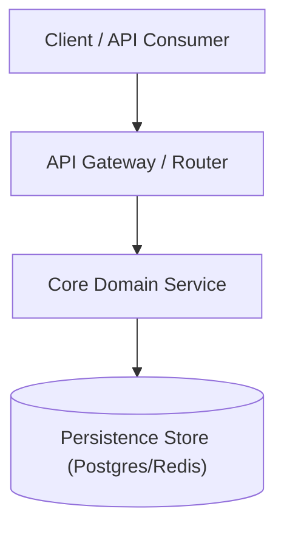
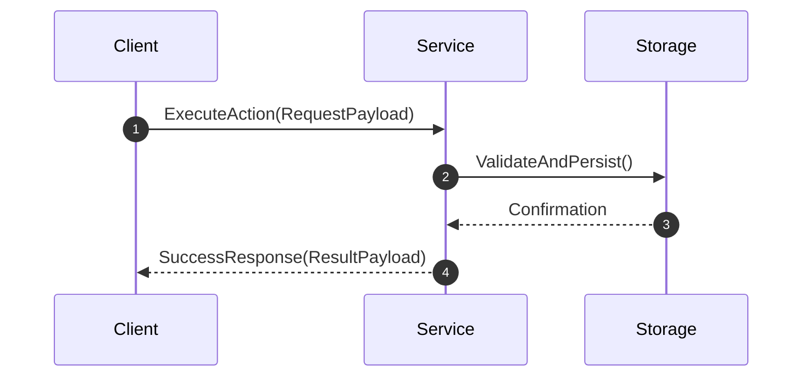
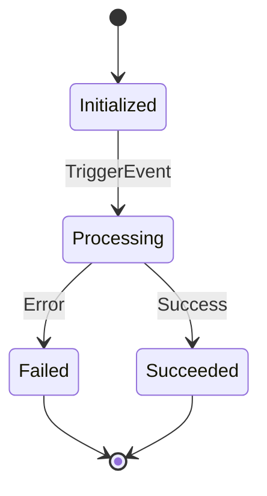

# Flow Spec (`/flow-spec`)

Phase 3: Specification Writing.

Transform validated architectural designs from [`/flow-brainstorm`](../flow-brainstorm/SKILL.md) into authoritative, unambiguous, and testable engineering specifications.

```text
  ┌─────────────────────────────────────────────────────────────┐
  │ Input: Validated Brainstorm Design & Understanding Lock     │
  └──────────────────────────────┬──────────────────────────────┘
                                 │
                                 ▼
  ┌─────────────────────────────────────────────────────────────┐
  │ Precision Technical Writing & Contract Authoring            │
  │  - Active Voice & RFC 2119 Normative Language               │
  │  - Quantitative SLAs (Zero Hand-Waving Adjectives)          │
  │  - Runnable Schema Encodings (Structs, Types, Models)       │
  │  - Exact Invariants, Error Enums & Status Codes             │
  │  - Architecture Topology & Mermaid Data Flows               │
  │  - 💡 Mandatory /flow-adr Hook (Formal Decisions in docs/adr│
  └──────────────────────────────┬──────────────────────────────┘
                                 │
                                 ▼
  ┌─────────────────────────────────────────────────────────────┐
  │ 4-Point Spec Self-Review (Mandatory Inline Audit)           │
  │  [x] Placeholders  [x] Consistency  [x] Scope  [x] Ambiguity│
  └──────────────────────────────┬──────────────────────────────┘
                                 │
                                 ▼
  ┌─────────────────────────────────────────────────────────────┐
  │ User Sign-Off Gate ──► Handoff to /flow-plan (Phase 04)     │
  └─────────────────────────────────────────────────────────────┘
```

<HARD-GATE>
Do NOT begin implementation planning or coding during Phase 3. A specification must be written to disk, self-reviewed against the 4-point audit, and explicitly approved by the user before proceeding to /flow-plan.
</HARD-GATE>

---

## 1. Precision Technical Writing Rules

Every specification produced must strictly obey these technical prose standards:

### A. Ban Weak Modal Verbs (RFC 2119 Normative Standard)
- ❌ **Banned Words**: *"should"*, *"might"*, *"could"*, *"probably"*, *"ideally"*, *"as needed"*, *"etc."*.
- ✅ **Required Terms**: **`MUST`**, **`MUST NOT`**, **`REQUIRED`**, **`EXPLICITLY REJECTS`**.
- *Example*:
  - ❌ *"The service should ideally validate tokens and might return an error."*
  - ✅ *"The AuthMiddleware MUST validate the JWT signature and MUST reject expired tokens with `HTTP 401 Unauthorized` and error code `AUTH_TOKEN_EXPIRED`."*

### B. Quantitative SLAs (Zero Subjective Adjectives)
- ❌ **Banned Fluff**: *"fast"*, *"performant"*, *"scalable"*, *"robust"*, *"lightweight"*, *"secure"*, *"clean"*.
- ✅ **Quantifiable Metrics**: Exact latencies, resource boundaries, throughputs, and timeouts.
  - *Latency*: *"p95 latency MUST be < 50ms; p99 < 150ms under 500 RPS."*
  - *Payload*: *"Maximum payload size is strictly capped at 2MB; larger requests are rejected with `HTTP 413`."*
  - *Concurrency*: *"Safe under 100 concurrent worker threads with zero mutex deadlocks."*

### C. Concrete Runnable Schema & Type Encodings
Do not write descriptive pseudocode. Output **exact runnable type definitions** matching the target programming language:

```typescript
// Example: Exact TypeScript / Pydantic / Go struct definitions required in the spec
export interface CreateSessionRequest {
  readonly userId: string;        // UUID v4 format
  readonly role: 'admin' | 'user' | 'guest';
  readonly ttlSeconds: number;    // Min: 60, Max: 86400
}

export interface CreateSessionResponse {
  readonly sessionId: string;
  readonly expiresAt: string;     // ISO 8601 UTC
}

export type AuthErrorCode = 
  | 'INVALID_UUID' 
  | 'TTL_OUT_OF_BOUNDS' 
  | 'UNAUTHORIZED_ROLE';
```

### D. Active Voice & Explicit Actors
Every requirement must state the exact subject performing the operation.
- ❌ *"Sessions are stored and notifications are sent."*
- ✅ *"The SessionManager writes the session record to Redis and publishes a `session.created` event to RabbitMQ."*

---

## 2. Mandatory ADR Hook (`/flow-adr`)

> [!IMPORTANT]
> **Permanent Architectural Decision Trigger**:
> If this specification introduces or alters major architectural choices (e.g. database/persistence engine, messaging broker, framework adoption, authentication boundary, or service decoupling), you **MUST activate [`/flow-adr`](../flow-adr/SKILL.md)** to:
> 1. Author a formal record at `docs/adr/NNNN-[title-with-dashes].md`.
> 2. Update the master index at `docs/adr/README.md`.
> 3. Link the generated ADR directly in **Section 7 (Architectural Decision Log)** of the specification.

---

## 3. Specification Storage & Naming Standard

- **Target Directory**: `docs/specs/` at the repository root.
- **Filename Convention**: `docs/specs/YYYY-MM-DD-[feature-name]-spec.md` (e.g. `docs/specs/2026-09-01-auth-tokens-spec.md`).
- If `docs/specs/` does not exist, create it automatically.

---

## 4. Specification Document Template

````markdown
# Specification: [Feature Name]

- **Date**: YYYY-MM-DD
- **Status**: Draft | Approved | Superceded
- **Tier**: Full Tier | Quick Tier
- **Blast Radius**: Level 1 (Isolated) | Level 2 (Package) | Level 3 (Cross-Module) | Level 4 (System-Critical)
- **Author**: Antigravity + [User]

---

## 1. Executive Summary & Scope Boundaries
- **Background**: Concrete justification for feature/subsystem existence.
- **Problem Statement**: Specific, quantified pain point resolved.
- **Explicit Non-Goals**: Hard boundaries of what this specification will NOT implement.

---

## 2. Architecture Topology & Component Models
- **Component Diagram**:

- **Data Flow & Sequence**:

- **State Machine & Lifecycle Transitions**:


---

## 3. API & Data Contract Schemas
- **Exact Data Models & Types**:
```python
# Exact structs / dataclasses with field-level types and constraints
from dataclasses import dataclass
from typing import Literal

@dataclass(frozen=True)
class SessionPayload:
    user_id: str
    role: Literal["admin", "member"]
    max_ttl_seconds: int = 3600
```
- **Function / REST / RPC Signatures**:
  - `POST /api/v1/sessions`
  - Headers: `Authorization: Bearer <token>`, `Content-Type: application/json`
  - Status Codes: `201 Created`, `400 Bad Request`, `401 Unauthorized`, `429 Too Many Requests`
- **Error Response Shape**:
```json
{
  "error": {
    "code": "SESSION_EXPIRED",
    "message": "The provided session token expired at 2026-09-01T12:00:00Z",
    "retryable": false
  }
}
```

---

## 4. System Invariants & Safety Constraints
- **Data Invariants**: Non-negotiable state rules (e.g. `"Account balance MUST NEVER drop below zero"`).
- **Concurrency Guarantees**: Mutexes, atomic CAS operations, idempotency keys, and isolation levels.
- **Security & Privacy**: Input sanitization boundaries, secret masking in logs, auth token TTLs.
- **Degraded Modes & Fault Recovery**: Behavior when storage/cache times out (e.g. `"Fail-closed and return HTTP 503"`).

---

## 5. Quantitative SLAs & Performance Requirements
- **Latency**: P95 < 25ms, P99 < 75ms.
- **Throughput**: Sustains 2,000 requests/sec with < 2% CPU degradation.
- **Memory Footprint**: Heap allocation delta < 15MB.
- **Observability Telemetry**: Emits structured log event `auth.session.created` with `{ user_id, session_id, duration_ms }`.

---

## 6. Verifiable Acceptance Criteria (AC-XX)
- [ ] **AC-01 (Happy Path)**: Given a valid `SessionPayload`, when `create_session()` is invoked, then a `201 Created` response is returned with a valid UUIDv4 `session_id`.
- [ ] **AC-02 (Boundary Violation)**: Given a payload with `ttl_seconds = 0`, when `create_session()` is invoked, then `HTTP 400` with code `TTL_OUT_OF_BOUNDS` is returned.
- [ ] **AC-03 (Race Condition Defense)**: Given 10 concurrent requests with the same `idempotency_key`, then exactly 1 session is created and 9 return cached results.

---

## 7. Architectural Decision Log & ADR Links
- **Decision 1**: Adopted [Technology/Pattern] — Link to formal record: [ADR-0001](docs/adr/0001-*.md).
- **Decision 2**: [Choice made] vs [Alternatives rejected] — [Rationale based on constraints].
````

---

## 5. 4-Point Spec Self-Review (Mandatory Inline Audit)

Before presenting the specification for user sign-off, audit the draft against these 4 rules:
1. **Placeholder Scan**: Eliminate any `TBD`, `TODO`, `later`, or unwritten sections.
2. **Prose Precision Scan**: Check for banned weak words (*"should/might/could/fast"*). Replace with normative RFC 2119 language and exact metrics.
3. **Contract Consistency**: Verify that Mermaid diagrams, function signatures, and struct definitions match verbatim.
4. **Scope Integrity**: Ensure the spec describes a single, cohesive deliverable. Decompose if multiple subsystems are present.

---

## 6. User Sign-Off Gate & Handoff to `/flow-plan`

1. Save the spec file to `docs/specs/YYYY-MM-DD-[feature]-spec.md`.
2. Present the link and brief summary to the user:
   > *"Specification authored and audited at [`docs/specs/YYYY-MM-DD-[feature]-spec.md`](docs/specs/). Please review and confirm your approval before we proceed to [`/flow-plan`](../flow-plan/SKILL.md) (Phase 4)."*
3. **Hard Gate**: Wait for explicit user confirmation.
4. On approval, transition directly to **`/flow-plan`**.
